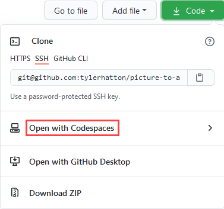
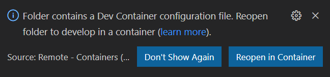
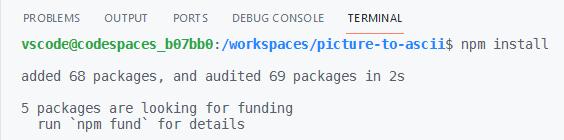
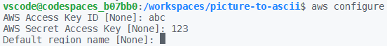
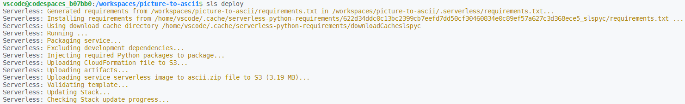
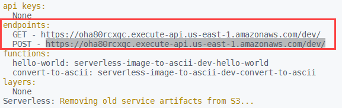
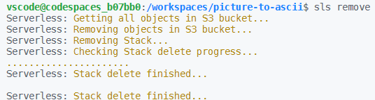

# Picture to Ascii Lambda Function

A simple example of deploying an [AWS Lambda](https://aws.amazon.com/lambda/) function using [Serverless Framework](https://www.serverless.com/).

## Instructions

1. If you don't already have an account, create an Amazon free tier account at https://aws.amazon.com/free/

2. Inside your AWS free tier account, create a new IAM user with programmatic access using the instructions here: https://docs.aws.amazon.com/IAM/latest/UserGuide/id_users_create.html

   Save the access key ID and access key for later use.

3. Open the picture-to-ascii GitHub repository devcontainer using [GitHub CodeSpaces](https://github.com/features/codespaces) or VS Code's [Remote - Container](https://code.visualstudio.com/docs/remote/containers) extension.

  

  

4. Inside the terminal pane, run ``npm install`` to install the Serverless Framework Node.js dependencies



5. Inside the terminal pane, run ``aws configure`` and enter the access key ID and access key created in step 2. The region name and output format can be left blank.



6. Run ``sls deploy`` to deploy the function into AWS.



7. Under the endpoints section, copy the URL next to "POST".



8. To test the Lambda function, run the following curl command replacing 'your url' with the URL you copied in the previous step.

```bash
curl --location --request POST 'your url' \
--header 'Content-Type: application/json' \
--data-raw '{
    "url": "https://upload.wikimedia.org/wikipedia/commons/thumb/8/89/Half-Life_lambda_logo.svg/480px-Half-Life_lambda_logo.svg.png"
}'
```

9. To remove the function from AWS run ``sls remove``.

